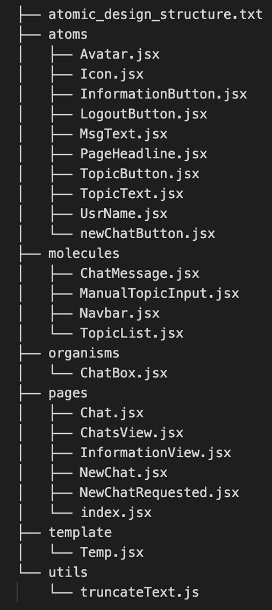

# Agile workflow

You can request access to our Kanban board in [Trello](https://trello.com/b/grC3PmLW/whisperweb).

# Wireframes and design system

You can find them at different fidelity levels in [Figma](https://www.figma.com/file/hg4nqNAxWmyMqfPcUOWbIt/WhisperWeb-Prototype?type=design&node-id=1-136&mode=design&t=3zjzxHdOoBhwyNta-0).

# Tech stack

## React and Vite

For accelerated loading times, we opted for working with React in Vite. The below template provides a minimal setup to get React working in Vite with HMR and some ESLint rules.

Currently, two official plugins are available:
- [@vitejs/plugin-react](https://github.com/vitejs/vite-plugin-react/blob/main/packages/plugin-react/README.md) uses [Babel](https://babeljs.io/) for Fast Refresh
- [@vitejs/plugin-react-swc](https://github.com/vitejs/vite-plugin-react-swc) uses [SWC](https://swc.rs/) for Fast Refresh

## Tailwind CSS

"Tailwind CSS is best used to _speed up the development process_ by writing less code. It comes with a design system that helps maintain _consistency across various design requirements_ like padding, spacing, and so forth; with this, you do not have to worry about creating your design systems." (Kinsta.com)

# Codebase structure following Atomic Design principles

Below is a visualisation of the directory of the “src” directory within out GitHub repository. It illustrates the structure of our core codebase following atomic design principles. 

The visualisation was created using the tool “tree”. Navigating to the respective src folder and entering “tree > atomic_design_structure.txt” in terminal yielded a txt file including the structure below.

